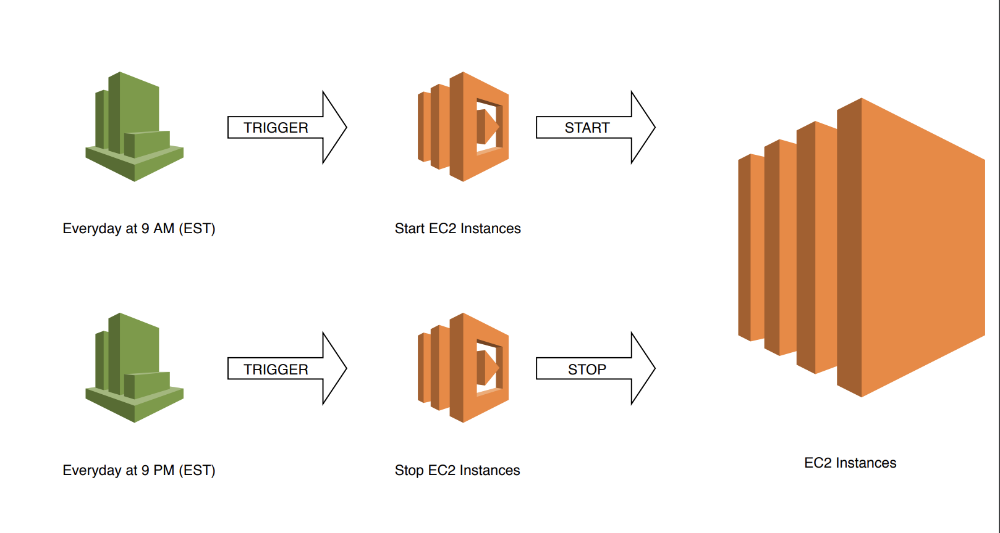

# Serverless EC2 Start Stop

This example demonstrates how to automate the start and stop of your [AWS EC2](https://aws.amazon.com/ec2/) instances using  [AWS Lambda](https://aws.amazon.com/lambda/) and [AWS Cloudwatch](https://aws.amazon.com/cloudwatch/) with a cron job to do it.

## Architecture

## Deploying the functions

Run the follwing command: `serverless deploy`

### Useful Links:

* [AWS Documentation](https://aws.amazon.com/documentation/)
* [AWS Lambda Documentation](https://docs.aws.amazon.com/lambda/latest/dg/welcome.html)
* [AWS Documentation on Github](https://github.com/awsdocs)
* [AWS Doc SDK Examples](https://github.com/awsdocs/aws-doc-sdk-examples)